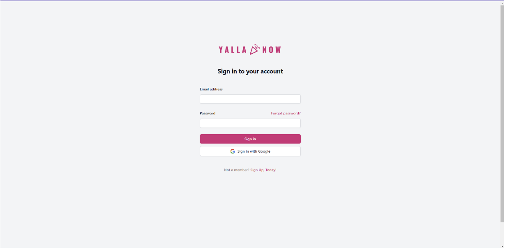
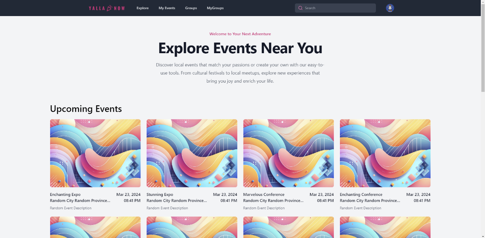
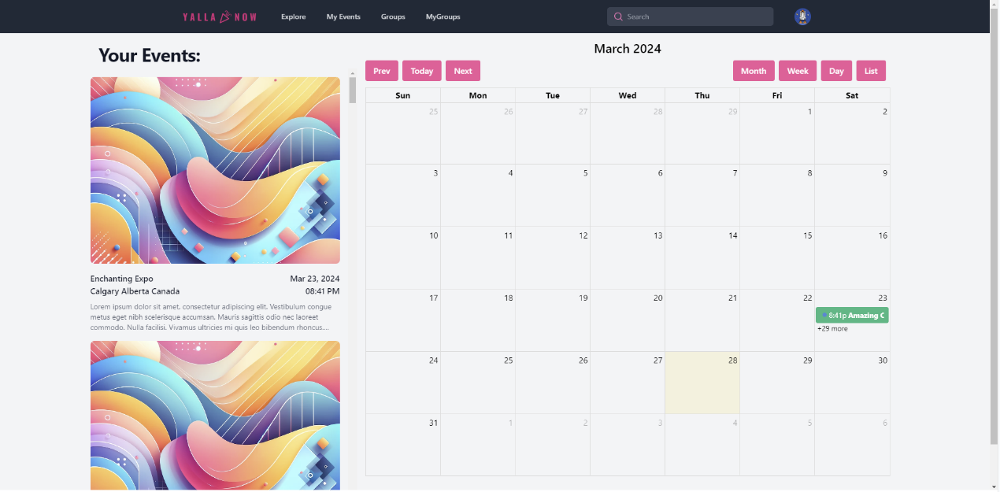
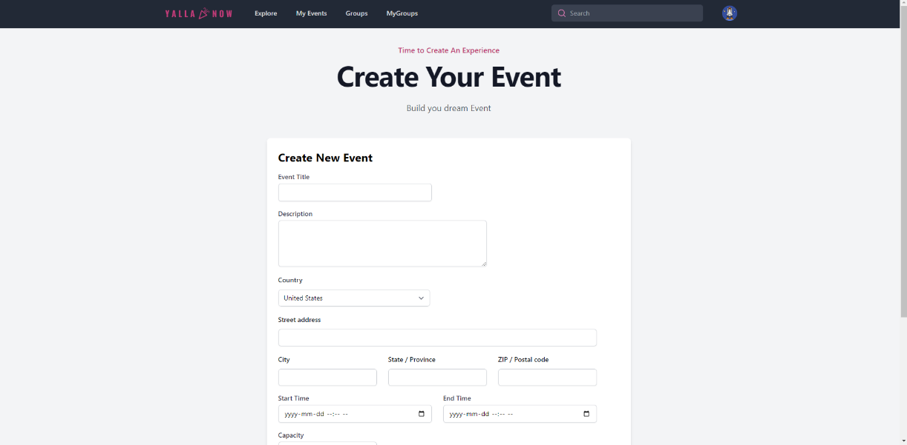
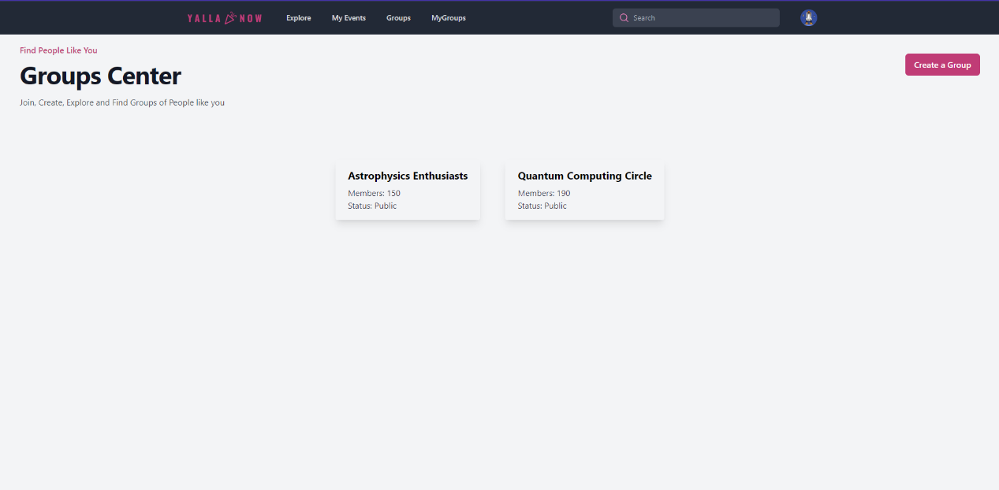
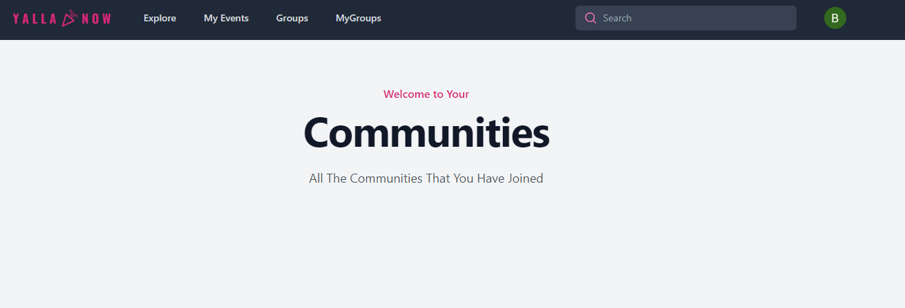
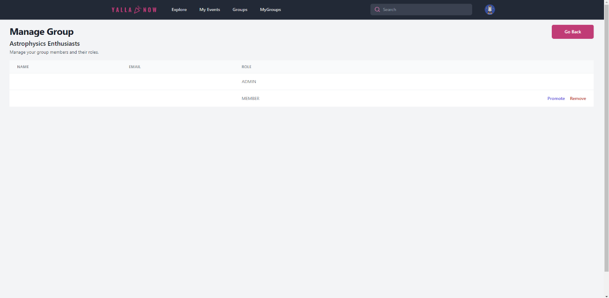
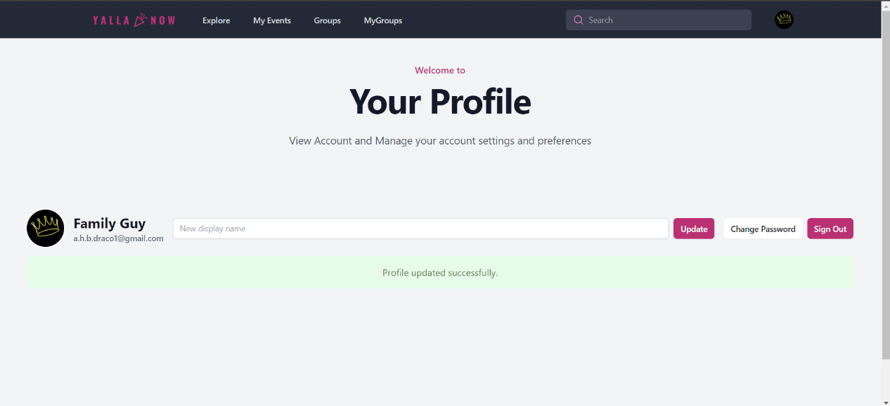

# YallaNow

YallaNow aims to create a scalable, robust social networking platform focusing on group interactions, event management, and enhanced user engagement through personalized content. It seeks to address the need for a cohesive online community where users can effortlessly organize, discover, and participate in events that match their interests, while fostering connections through groups. 

## Coding Language and Framworks Used

<div align="left">
  
  
  
  
  
  
  
  
  
  
  
  
  
  
  
  
  
  
  
  
  
  
  
  
  
  
  
  
  
  <p align="left"> <a href="https://firebase.google.com/" target="_blank" rel="noreferrer"> 
   
    </a>
 
</div>
## Link to web site
https://yallanow.netlify.app/

## How to run the project
To run the project first navigate to ./yallanow-frontend

```bash
cd ./yallanow-frontend
```

Then install all necessary packages through npm denoted by package.json

```bash
npm install <package_name>
```

After all of the required packages are installed run

```bash
npm run start
```

to start the project.

Here are screenshots of the project:

Login Page:


Event Page:


Calendar Page:


Create Event Page:


Group Page:


Joined Group Page:


Manage Group Page:


User Profile Page:



